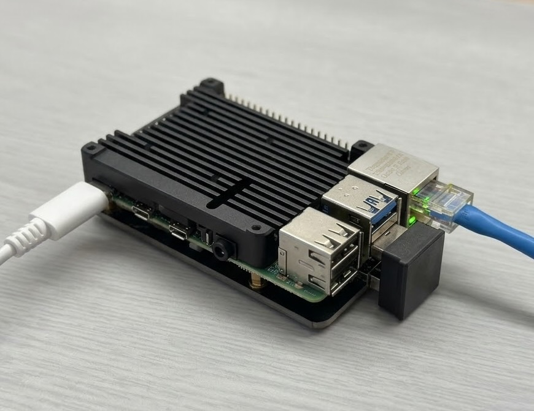
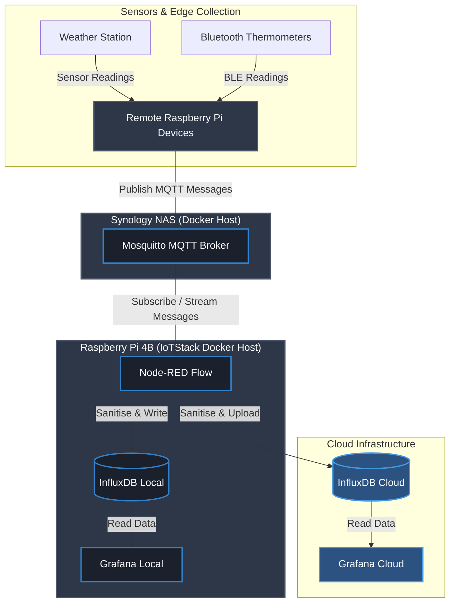

SensorHub
=========

   
  <em>Figure 1: My Raspberry Pi 4B setup running headless.</em>

## 🏗️ System Architecture

This project is built around an event-driven, hybrid-cloud IoT architecture designed for high availability, local resilience, and secure remote monitoring. The system splits responsibilities across localized edge collection, a centralized home message broker, a dedicated gateway processor, and a mirrored cloud visualization layer.

### Architectural Breakdown

#### 1. Data Acquisition & Edge Collection
* **Sensors**: Data originates from an outdoor weather station and multiple room/outbuilding Bluetooth Low Energy (BLE) thermometers.
* **Edge Collectors**: Distributed, secondary Raspberry Pi devices continuously sample these sensors, format the telemetry data, and transmit it upstream.

#### 2. Message Brokerage (Ingestion Layer)
* **Host**: Synology NAS running Docker.
* **Component**: **Eclipse Mosquitto MQTT Broker**.
* **Function**: Acts as a decoupled, central ingestion point. The edge devices publish sensor readings asynchronously to specific MQTT topics, ensuring that network fluctuations at the gateway do not result in data loss at the sensor level.

#### 3. Processing & Storage Gateway (IoTStack)
* **Host**: Raspberry Pi 4B managed via an **IoTStack** Docker container ecosystem.
* **ETL Pipeline (Node-RED)**: Node-RED subscribes to the Mosquitto broker topics on the NAS. It ingests the raw MQTT strings, sanitises and validates the payloads (handling missing values or malformed data), and executes a dual-write strategy.
* **Local Storage (InfluxDB)**: A time-series database running in a local container receives the sanitised data for low-latency, long-term historical storage within the local network.

#### 4. Visualization & Remote Access Layer
* **Local Dashboards (Grafana)**: A local Grafana container queries the local InfluxDB instance, providing real-time, high-resolution dashboards accessible anywhere inside the home network.
* **Cloud Mirroring (InfluxDB Cloud & Grafana Cloud)**: To bypass complex home-network port forwarding or VPN setups, Node-RED simultaneously pushes data to InfluxDB Cloud. A mirrored Grafana Cloud dashboard reads from this cloud instance, granting secure, encrypted remote access from anywhere in the world.

### System Resilience Features
* **Decoupling**: If the Raspberry Pi 4B goes offline for maintenance, the Mosquitto broker on the Synology NAS caches incoming MQTT data (if configured with persistence), preventing data loss.
* **Hybrid Cloud**: If the home internet connection drops, the local InfluxDB and Grafana instances continue to function perfectly. Data resumes syncing to the cloud once the connection is restored.
* **Containerization**: All software components run in isolated Docker containers, allowing for easy updates, independent scaling, and trivial backups via IoTStack.

