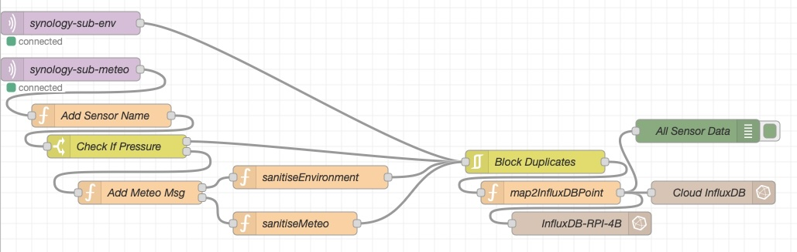

SensorHub
=========

**SensorHub** is a processing and storage gateway running on a headless Raspberry Pi 4B. It collects sensor readings coming from the central message broker as MQTT messages. The readings are sanitised before being written into the local InfluxDB time-series database. Local Grafana instance queries that database with a dashboard showing its data on graphs. InfluxDB / Grafana setup is mirrored in the cloud for remote access.</br>
This project brings together a weather station data collected by [SDRGateway](https://github.com/dkazubek/SDRGateway) and data collected from Bluetooth thermometers by [BTGateway](https://github.com/dkazubek/BTGateway).

<p align="center">
  <br>
  <em>Figure 1: Raspberry Pi 4B running the SensorHub IOTstack services.</em>
</p>

## 🏗️ System Architecture

This project is built around an event-driven, hybrid-cloud IoT architecture designed for local resilience, and secure remote monitoring. The system splits responsibilities across localized edge collection, a centralized home message broker, a dedicated gateway processor, and a mirrored cloud visualization layer.


<em>Figure 2: System Architecture.</em>

### Node-RED Flow

<p align="center">
  <br>
  <em>Figure 3: The Node-RED flow.</em>
</p>

Example data going into the InfluxDB:
1. **Data from thermomenters**</br>
    ```text
    measurement: "environment"
    fields:
        temperature_c: 22.3
        humidity_pct: 66
        battery_pct: 47
    tags:
        device_id: "AA:BB:CC:DD:EE:01"
        house: "demo-house"
        room: "demo-room"
        sensor_name: "ATC_ABCDEF"
        sensor_type: "thermometer"
        brand: "Xiaomi"
        model: "LYWSD03MMC_MJWSD05MMC_ATC"
    timestamp: "2026-09-03T08:48:02.023Z"
    ```
2. **Data from weather station**</br>
    ```text
    measurement: "weather"
    fields:
        temperature_c: 19.5
        humidity_pct: 77
        battery_ok: true
        wind_direction_deg: 71
        wind_speed_avg_m_s: 0.191
        wind_gust_m_s: 0.51
        rain_total_mm: 430.276
        uv: 706
        uv_index: 1
        illuminance_lux: 30807
    tags:
        device_id: "1234"
        house: "demo-house"
        room: "garden"
        sensor_name: "WH65B_1234"
        sensor_type: "weather_station"
        brand: "Fineoffset"
        model: "Fineoffset-WH65B"
        radio_frequency: "868.000MHz"
    timestamp: "2026-09-03T08:42:38.797Z"
    ```

### Architectural Breakdown

#### 1. Data Acquisition & Edge Collection
* **Sensors**: Data originates from an outdoor weather station and multiple room/outbuilding Bluetooth Low Energy (BLE) thermometers.
* **Edge Collectors**: Distributed, secondary Raspberry Pi devices continuously sample these sensors, format the telemetry data, and transmit it upstream.

#### 2. Message Brokerage (Ingestion Layer)
* **Host**: Synology NAS running Docker.
* **Component**: **Eclipse Mosquitto MQTT Broker**.
* **Function**: Acts as a decoupled, central ingestion point. The edge devices publish sensor readings asynchronously to specific MQTT topics, ensuring that network fluctuations at the gateway do not result in data loss at the sensor level.

#### 3. Processing & Storage Gateway (IOTstack)
* **Host**: Raspberry Pi 4B managed via an **IOTstack** Docker container ecosystem.
* **ETL Pipeline (Node-RED)**: Node-RED subscribes to the Mosquitto broker topics on the NAS. It ingests the raw MQTT strings, sanitises and validates the payloads (handling missing values or malformed data), and executes a dual-write strategy.
* **Local Storage (InfluxDB)**: A time-series database running in a local container receives the sanitised data for low-latency, long-term historical storage within the local network.

#### 4. Visualization & Remote Access Layer
* **Local Dashboards (Grafana)**: A local Grafana container queries the local InfluxDB instance, providing real-time, high-resolution dashboards accessible anywhere inside the home network.
* **Cloud Mirroring (InfluxDB Cloud & Grafana Cloud)**: To bypass complex home-network port forwarding or VPN setups, Node-RED simultaneously pushes data to InfluxDB Cloud. A mirrored Grafana Cloud dashboard reads from this cloud instance, granting secure, encrypted remote access from anywhere in the world.

### System Resilience Features
* **Decoupling**: If the Raspberry Pi 4B goes offline for maintenance, the Mosquitto broker on the Synology NAS caches incoming MQTT data, preventing data loss.
* **Hybrid Cloud**: If the home internet connection drops, the local InfluxDB and Grafana instances continue to function perfectly. Data resumes syncing to the cloud once the connection is restored.
* **Containerization**: All software components run in isolated Docker containers, allowing for easy updates, independent scaling, and backups via IOTstack.

### Prerequisites / Deploy
* **Hardware:** According to [IOTstack](https://sensorsiot.github.io/IOTstack/Basic_setup/) requirements, a device like Raspberry Pi 3B+ or 4B would perform well.
* **Software:**
    * Docker with IOTstack configured with Node-RED, InfluxDB and Grafana containers.
    * Node-RED project dependencies are installed from `package.json`.
    * InfluxDB URLs and MQTT topics are loaded from environment variables.
* **Python helper:** `mem.py` reports memory usage for the Node-RED health dashboard. Install its dependency:

    ```bash
    sudo apt install python3-psutil
    ```
* **Dashboard:** Grafana dashboard can be imported into a Grafana instance from `dashboards/home-weather.json`.
